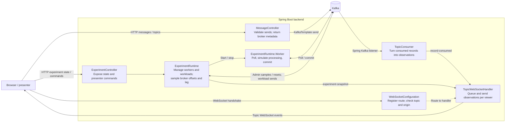

# Kafka lessons

Runnable partitioning, ordering, consumer groups, offsets/replay and lag lessons.
Depends on the sibling [Kafka core](../kafka-demo/README.md).

## First-time setup

Start with **[SETUP.md](SETUP.md)** for participant requirements, a self-contained
local Kafka broker, running the slides, and editing producer/consumer code.
The default `compose.yml` runs Kafka, topic initialization, and [Kafbat UI](http://localhost:8081);
run the lesson application locally with JDK 21. No migration or workshop infrastructure is required.
In Kafbat, select **lessons → Topics → kafka-demo → Messages** and use String
deserialization for demo keys and values.

## Alternative: use an existing workshop broker

Requires JDK 21 and the workshop Kafka broker. Create both demo topics once in the current Docker context:

If your default Java is newer than the Gradle wrapper supports, set `JAVA_HOME` to a JDK 21 installation first.

```sh
docker exec kafka1 kafka-topics --bootstrap-server kafka1:9092 \
  --create --if-not-exists --topic kafka-demo --partitions 3 --replication-factor 1
docker exec kafka1 kafka-topics --bootstrap-server kafka1:9092 \
  --create --if-not-exists --topic kafka-demo-lab --partitions 3 --replication-factor 1
./gradlew -PkafkaDemoCore=../kafka-demo bootRun
```

The backend listens at `http://localhost:8080`. Topics must exist before startup; the consumer does not create topics. Existing topics are never resized by the application. The optional experiment API can reset offsets only for its inactive allowlisted groups.

The workshop Compose stack also includes [Kafbat UI](http://localhost:8081). Open **workshop → Topics → kafka-demo → Messages** and compare a presentation record's topic, partition, offset, key, and value. Kafbat connects to the same broker through `kafka1:9092`; select String deserialization for demo keys and values. See the [workshop instructions](../kafka-workshop/README.md#browse-records-with-kafbat-ui) for startup details.

### Use POC legacy Kafka for the lesson deck

The `poc-legacy` profile runs the full lesson backend against the POC's **direct
legacy listener**, with no workshop broker required. It does not route lesson
traffic through Kroxylicious. This profile belongs to the standalone lessons application; migration runs separately.

Start the POC, then keep this port forward running in a separate terminal:

```sh
kubectl --context kind-kafka-proxy-poc --namespace kafka-platform-poc \
  port-forward svc/legacy-broker 32095:32095
```

Use this project’s `.local/client.properties`, or supply another standard Kafka
client properties file with POC credentials. The profile
requires `KAFKA_CLIENT_PROPERTIES` and reads `sasl.jaas.config` from that file;
it configures SASL_PLAINTEXT / SCRAM-SHA-512 for producers, observers and experiment
clients. Keep the file local and restricted. Bootstrap and group settings come
from the profile, not unprefixed settings in the client properties file.

Create the lesson topics once using the Kafka CLI, with credentials authorized
for topic creation (run from this checkout with `kafka-topics` on PATH):

```sh
kafka-topics --bootstrap-server localhost:32095 \
  --command-config "$PWD/.local/client.properties" \
  --create --if-not-exists --topic kafka-demo --partitions 3 --replication-factor 1
kafka-topics --bootstrap-server localhost:32095 \
  --command-config "$PWD/.local/client.properties" \
  --create --if-not-exists --topic kafka-demo-lab --partitions 3 --replication-factor 1
```

Stop any existing lesson backend on port 8080, build the JAR with
`./gradlew -PkafkaDemoCore=../kafka-demo bootJar`,
and start with JDK 21. On macOS, select it explicitly (the default `java` may be a
different version):

```sh
KAFKA_CLIENT_PROPERTIES="$PWD/.local/client.properties" \
SPRING_PROFILES_ACTIVE=poc-legacy PORT=8080 \
"$(/usr/libexec/java_home -v 21)/bin/java" -jar build/libs/kafka-lessons-0.1.0-SNAPSHOT.jar
```

Open http://localhost:8080/. The migration deck can remain on port 18080.
The lesson observer group defaults to `kafka-demo-poc-observer`, with experiment
groups `kafka-demo-poc-experiment-a` and `-b`. Lessons use `kafka-demo` and
`kafka-demo-lab`, separate from the POC's `demo.topic*` and `telemetry` topics.
The lesson credential needs read/write access to the lesson topics and group
permissions for the observer and experiments, including lesson offset resets.

If acknowledgments time out, check that the port forward is running in the same
network environment as the backend and that both lesson topics exist. An
`AdminClient thread has exited` error describes a stopped client; inspect the
earlier exception for its cause, then restart the backend after correcting it.
Browser reconnect does not recreate the backend's AdminClient.

## Live slides

Open `http://localhost:8080/` after starting the application. The reveal.js deck introduces partitioning, offers predictions, runs a live producer/consumer experiment, and points to the Kotlin code to change.

On the experiment slide, select a configured topic, send several records with `customer-1`, then change the key or leave it empty for a null key. The acknowledgment reports the broker's partition and offset; cards appear only from the separate WebSocket consumption stream. Only observed partitions appear, and each retains four cards. Clear display resets browser observations only.

The deck keeps one WebSocket alive across slide navigation and retries closed connections with capped backoff. Reconnect does not replay missed observations. A subscription confirms the viewer connection, not Kafka partition assignment; wait for the backend's assignment log before presenting. Opening another window adds a viewer, not a Kafka consumer.

Use arrow keys to navigate, Esc for overview, and F for fullscreen. Form controls retain their normal keyboard behavior. Pinned reveal.js 5.2.1 assets and their MIT license are included under the shared `/kafka-demo/vendor/reveal/` resource path. The slides need no external network access or frontend build at runtime.

To refresh the bundled library after intentionally changing its version in `package.json`, run `npm install` and `npm run vendor` in the core checkout, then commit the lockfile and vendor assets. For an unchanged lockfile, use `npm ci` instead. Gradle includes the checked-in assets in the application JAR.

The frontend is plain JavaScript served by Spring Boot from `src/main/resources/static`, using same-origin HTTP and WebSocket URLs. `index.html` defines the lesson, `js/slides.js` wires navigation and controls, `js/live-client.js` adds experiments to core transport, and `js/concepts/partitioning.js` renders observations. New concepts register a mount function that returns `onRecord` and `reset`, with optional `onExperiment` for experiment snapshots. Commands are wired separately in `js/controls`.

## Produce a record with curl

```sh
curl -sS http://localhost:8080/api/messages \
  -H 'Content-Type: application/json' \
  -d '{"key":"customer-1","value":"Hello Kafka"}'
```

An optional `topic` selects another configured topic. Otherwise `KAFKA_DEFAULT_TOPIC` is used. The required `value` is a string (up to 16,384 characters); `key` is optional (up to 1,024 characters). JSON payloads can be encoded inside the string. This version does not use Avro or Schema Registry.

HTTP 200 means Kafka acknowledged the write. The response contains its actual `topic`, `partition`, `offset`, and `timestamp`. Malformed requests return 400, unconfigured topics return 404, and Kafka send failures return 503. A timeout can be ambiguous: the broker may have accepted a record even if the acknowledgment was not received. Retrying an HTTP request may produce a duplicate.

`GET /api/topics` lists the configured topics and default. It is configuration discovery, not a broker health check.

## Subscribe over WebSocket

Open `http://localhost:8080/api/topics` in a browser, then run in its developer console:

```js
const socket = new WebSocket('ws://localhost:8080/ws/topics/kafka-demo');
socket.onmessage = event => console.log(JSON.parse(event.data));
socket.onclose = event => console.log('Stream closed', event.code, event.reason);
```

The first event is `{"type":"subscribed","version":1,"topic":"kafka-demo"}`. This confirms the WebSocket subscription, not Kafka partition assignment. Once the backend consumer has joined its group, subsequent events look like:

```json
{
  "type": "record-consumed",
  "version": 1,
  "topic": "kafka-demo",
  "partition": 0,
  "offset": 42,
  "timestamp": 1788800000000,
  "key": "customer-1",
  "value": "Hello Kafka",
  "headers": []
}
```

Headers preserve their order and duplicate names; binary values use `valueBase64`. Kafka tombstones appear as a null `value`. Partition and offset identify the Kafka record; ordering is only meaningful within each partition.

- One application consumer subscribes to every configured topic at startup. Each WebSocket selects one of those topics by URL. Closing a socket unsubscribes that viewer, without changing Kafka membership.
- Multiple viewers receive copies of the same consumed records. Run one backend instance for this version; instances sharing a group divide partitions, so their viewers would see different subsets.
- With no viewers for a topic, consumed records are logged and discarded from the display pipeline. Batch offset commits continue. This does not delete records from Kafka.
- WebSocket delivery is best-effort, with no replay or client acknowledgment. Reconnecting resumes observations as they arrive. Consumer restarts can still redeliver uncommitted records or process a retained backlog; `latest` applies only when the group has no valid committed offset.
- Each viewer has a queue of 64 events and a dedicated sender. A slow viewer or an event larger than 256 KiB closes that stream with code 1008. At most 32 viewers connect at once. Kafka does not wait on socket sends.

## Configuration

The defaults below work with the local broker in [SETUP.md](SETUP.md).
Export any overrides in the shell before starting; Spring does not automatically read `.env` files.

| Variable | Default | Purpose |
| --- | --- | --- |
| `KAFKA_BOOTSTRAP_SERVERS` | `localhost:9094` | Workshop broker; comma-separated for multiple brokers |
| `KAFKA_TOPICS` | `kafka-demo,kafka-demo-lab` | Topic allowlist consumed at startup |
| `KAFKA_DEFAULT_TOPIC` | `kafka-demo` | Default producer topic; must be in the allowlist |
| `KAFKA_GROUP_ID` | `kafka-demo` | Dedicated group, independent of workshop consumers |
| `PORT` | `8080` | HTTP and WebSocket port |
| `SERVER_ADDRESS` | `127.0.0.1` | Local bind address |
| `WEBSOCKET_ALLOWED_ORIGINS` | localhost:8080, 127.0.0.1:8080, localhost:5173 (HTTP) | Allowed browser origins |

For example, after creating both topics:

```sh
KAFKA_TOPICS=kafka-demo,orders DEMO_EXPERIMENT_ENABLED=false KAFKA_DEFAULT_TOPIC=orders ./gradlew -PkafkaDemoCore=../kafka-demo bootRun
```

All standard `spring.kafka.*` properties remain available for security and consumer/producer tuning. The HTTP API has no authentication and defaults to loopback for local workshops. HTTP browser CORS is not enabled; the slides use the backend's origin. When changing `PORT` or the browser hostname, include that origin in `WEBSOCKET_ALLOWED_ORIGINS`.

## Backend structure and code to teach from

The backend is one Spring Boot application, with all classes in
`src/main/kotlin/io/bekk/kafkalessons`. HTTP controllers accept presenter requests;
Kafka consumers supply observations; one WebSocket handler delivers them to
viewers. The ordinary producer path uses `KafkaTemplate` directly, so the code
responsible for a send is easy to find.

There are two independent consumption paths. `TopicConsumer` observes configured
topics from startup, even with no viewers. The `ExperimentRuntime` owns
separate consumer groups for the groups, replay and lag lessons; its workers start
only on explicit commands. Opening a socket or navigating slides changes neither
path's Kafka membership.



Arrows show the main calls and event paths, not every injected dependency. Startup
and shared configuration are described below.

| Class / file | Responsibility and useful changes to inspect |
| --- | --- |
| [Application](src/main/kotlin/io/bekk/kafkalessons/Application.kt) | Boot entry point; discovers components and configuration properties. |
| [DemoProperties](../kafka-demo/backend/src/main/kotlin/io/bekk/kafkademo/core/DemoProperties.kt) | Holds and validates the topic allowlist and producer default; transport origins are configured separately. |
| [MessageController](../kafka-demo/backend/src/main/kotlin/io/bekk/kafkademo/core/MessageController.kt) | Lists configured topics, validates production requests, sends through `KafkaTemplate`, and returns acknowledgment metadata. Request/response data classes live here too. |
| [TopicConsumer](../kafka-demo/backend/src/main/kotlin/io/bekk/kafkademo/core/TopicConsumer.kt) | Converts Spring Kafka listener records into the `ConsumedMessage` envelope defined in the same file, then publishes to viewers. |
| [ExperimentController](src/main/kotlin/io/bekk/kafkalessons/ExperimentController.kt) | Thin HTTP adapter for runtime snapshots and commands; translates command failures into HTTP responses. |
| [ExperimentRuntime](src/main/kotlin/io/bekk/kafkalessons/ExperimentRuntime.kt) | Validates experiment commands; owns worker lifecycle, per-group delay, bounded workloads/history, broker sampling and inactive-group offset resets. Its private `Worker` contains the plain `KafkaConsumer` poll/process/commit loop. |
| [TopicWebSocketHandler](../kafka-demo/backend/src/main/kotlin/io/bekk/kafkademo/core/TopicWebSocketHandler.kt) | Owns viewer connections, bounded queues and sender threads; fans out by topic and disconnects slow viewers. Retains the latest experiment snapshot for reconnects, but no consumed-record replay buffer. |
| [WebSocketConfiguration](../kafka-demo/backend/src/main/kotlin/io/bekk/kafkademo/core/WebSocketConfiguration.kt) | Registers the socket route, origin allowlist and topic-checking handshake; `KafkaObserverConfiguration` supplies topic validation and the listener topic names. |
| [application.yml](src/main/resources/application.yml) | Supplies cluster connection, observer group, acknowledgment policy, producer settings and environment overrides. |

The WebSocket boundary keeps socket writes off Kafka's listener thread. A
`record-consumed` event establishes that the observer received a record; processing
and commit observations come from the separate experiment workers. The demo's
processing step is a configurable sleep, not an external business operation.

## Tests

```sh
./gradlew -PkafkaDemoCore=../kafka-demo test
./gradlew -PkafkaDemoCore=../kafka-demo bootJar
```

Lesson integration tests use an embedded KRaft broker for experiment membership, processing, commits and replay. Core tests separately cover HTTP/WebSocket fan-out, topic isolation, no-viewer commits, request validation and slow viewers. No backend test depends on the workshop broker.

Browser smoke tests require the running application and its Kafka consumer to have partition assignments. They **produce six records** into the configured default topic, check real acknowledgments against observed cards, bounded display history, literal rendering of HTML-like input, navigation without socket replacement, reconnect, and a simulated HTTP failure:

```sh
npm ci
npx playwright install chromium
npm run test:browser
```

Set `DEMO_URL` to test a different application origin; ensure that origin is allowed by the backend. Screenshots are written to `build/slides-title.png` and `build/slides-live.png`.

To check a running backend against the real workshop broker (produces one message to `kafka-demo`):

```sh
java scripts/SmokeTest.java http://localhost:8080
```

This opens two WebSocket subscriptions, produces via HTTP, and checks both viewers receive the same record with the acknowledged Kafka partition and offset. Wait for the backend's partition assignment log before running it.

### Build with Docker

From this project root, with both sibling checkouts present:

```sh
docker run --rm \
  -v "$PWD:/projects/kafka-lessons" -v "$PWD/../kafka-demo:/projects/kafka-demo" \
  -v kafka-demo-gradle-cache:/home/gradle/.gradle -w /projects/kafka-lessons \
  gradle:8.14.3-jdk21 gradle --no-daemon -PkafkaDemoCore=../kafka-demo test bootJar
```

A packaged application contains its shared libraries and needs no sibling checkout
at runtime. Run `java -jar build/libs/kafka-lessons-0.1.0-SNAPSHOT.jar` with the Kafka
settings above. Stop the old observer before replacing it with the same group ID.

## Ordering, groups, replay and lag lessons

Ordering works with the original setup at `http://localhost:8080/#/ordering`.
The remaining lessons use experiments, which are **enabled by default**. The Run
instructions create both required topics; no enable flag is needed. Startup begins
periodic broker sampling and permits commands to start dedicated consumers,
generate bounded workloads and reset offsets for inactive experiment groups.
Workers and workloads still require explicit presenter commands; browser navigation
and WebSocket connections never start them. Use a dedicated lab topic and group
prefix, with broker permissions for the experiment's production, consumption,
topic/group inspection and offset resets.

**Explicitly opt out** with `DEMO_EXPERIMENT_ENABLED=false` when running only the
basic producer, partitioning and ordering demo, or using a shared/restricted cluster
where experiment commands should be unavailable. This disables experiment broker
sampling and rejects experiment commands. If the lab topic is absent, also remove
it from the observer's topic allowlist:

```sh
KAFKA_TOPICS=kafka-demo DEMO_EXPERIMENT_ENABLED=false ./gradlew -PkafkaDemoCore=../kafka-demo bootRun
```

For Docker, pass `-e DEMO_EXPERIMENT_ENABLED=false -e KAFKA_TOPICS=kafka-demo`
to the application container for the same basic setup. Disabling experiments alone
does not change the observer's configured topics.

Use one backend instance and wait for its observer partition assignment before
producing. The runtime does not create topics or start members on its own.

| Variable | Default | Purpose |
| --- | --- | --- |
| `DEMO_EXPERIMENT_ENABLED` | `true` | Set `false` to disable experiment broker sampling and commands |
| `DEMO_EXPERIMENT_TOPIC` | `kafka-demo-lab` | Pre-created topic, must also appear in KAFKA_TOPICS |
| `DEMO_EXPERIMENT_GROUP_PREFIX` | `kafka-demo-experiment` | Two allowlisted groups, with suffixes `-a` and `-b`; keep separate from observer/workshop groups |

Visit `/#/groups`, click **Observe experiment topic**, and start one member in A.
Add members up to four; with three partitions, one will be idle after assignment.
Start B and send fresh records to compare independent groups. Group membership
continues through navigation and viewer disconnection. **Stop group members** is
explicit; backend shutdown also stops workers.

At `/#/offsets`, stop a group and wait for its members to exit. Pick a partition and
an offset between the sampled Start and End, reset it, then restart. Resets change
one partition only. `earliest`/`latest` is an initial-position policy, used only when
there is no valid commit. To repeat a fresh-group comparison after both groups have
commits, restart with a new dedicated group prefix; a display reset does not erase
commits. Fetch position, processed progress and commit are next-offset markers.

At `/#/lag`, use the previously started workers, apply a processing delay, and send
60 records at 50 ms intervals. Stop production or wait for the bounded workload to
finish, then reduce delay to zero to observe recovery. Delay is selected per group in the membership widget and applies to each of its
workers, including members started later. The workload explicitly cycles through actual topic partitions. It is
capped at 120 records through the API; processing delay is capped at 1000 ms.

`GET /api/experiment` returns current configuration/state. `POST /api/experiment`
accepts `{ "action": "start", "group": "kafka-demo-experiment-a", "policy": "earliest" }`.
Other actions are `stop` (group), `delay` (group, delayMs), `produce` (count, intervalMs),
`stop-production`, and `reset` (group, partition, offset). Concurrent transitions
and invalid operations are rejected or serialized; errors include a message.
Production is never automatically retried after an uncertain acknowledgment.

Experiment snapshots share the topic WebSocket. They restore the latest state on
reconnect and retain at most 48 recent events. Lag charts retain 40 samples. Unknown
commits and stale broker observations are explicit. Zero committed lag does not
prove external business processing; the demo processing step is an intentional
sleep. Consumed-record delivery still has no replay buffer.

`ExperimentRuntime.kt` contains the readable poll/process/commit loop and broker
sampling; `ExperimentController.kt` exposes bounded presenter commands. The three
experiment views are independent modules using optional `onExperiment(snapshot)`.
See [ADR-00007](../kafka-demo/docs/adr/ADR-00007-controlled-experiment-runtime.md).

The browser suite now also exercises ordering and experiment navigation and needs
this enabled setup. In addition to the original six messages, it sends six ordering
records and a 60-record lab workload. It stops its experiment workers afterward.

Each experiment panel, including lag, now contains the same compact membership
widget. Choose Group A or B, use **+ Add member** or **Stop group**, and inspect the
member count and partition chips in place. **Start position** expands the initial
offset policy. Status summarizes observed workers/assignments; Unknown indicates
stale or missing observations. Group selection changes only the panel's command
target, without creating consumers or switching the shared topic.

Processing delay is now a group setting on all experiment slides. Selecting a delay
applies it immediately to the chosen group; snapshots expose `groupDelays` keyed
by actual group ID. Delay commands require a group. Values remain bounded to
0–1000 ms per record; group settings survive member stops but reset on backend restart.


## Verify without external infrastructure

The backend tests use embedded Kafka. For the full browser suite, run this in one
terminal (JDK 21); it starts a temporary real broker and the lesson application:

```sh
./gradlew -PkafkaDemoCore=../kafka-demo browserTestServer
```

In another terminal:

```sh
npm ci
npx playwright install chromium
npm run test:browser
```

Stop the test server when finished. It does not use the workshop or POC. Override
`PORT` and `DEMO_URL` if 8080 is occupied. Ordinary `bootRun` uses your configured
external Kafka cluster. The scripts `scripts/run.sh` and `scripts/status.sh` build/run
this demo and check its HTTP endpoint; they do not start or stop other demos.

## POC Docker runtime

The verified runtime uses this project's `compose.poc.yml` and `kafka-lessons:local` image.
This is an optional setup for the existing `kind-kafka-proxy-poc` environment.
It neither provisions the POC nor runs migration commands.

Local prerequisites (all files under `.local` remain ignored):

- `.local/client.properties`: the standard POC Kafka credentials, mode 600.
- `.local/kubeconfig-docker`: credentials for the explicit Kind context, with an API
  server address reachable on the Docker `kind` network, mode 600.
- `.local/kubectl-linux`: a Linux kubectl executable matching the container's CPU
  architecture, mode 755. It is used by the optional port-forward service.
- The existing `kind` Docker network, POC broker, and required topics must be ready.

The checked local kubeconfig uses `https://kafka-proxy-poc-control-plane:6443` with
`tls-server-name: 127.0.0.1` to retain certificate verification. This is local runtime
configuration, not a core default. When recreating Kind, refresh the kubeconfig from
that context and adjust its server for Docker reachability; do not disable TLS
verification. Keep the host-oriented `.local/kubeconfig` for host runs if needed.
Credentials are never copied into either application image. The Docker build context
is restricted by `.dockerignore` to the JAR.

From this project root:

```sh
./scripts/build-image.sh
docker compose -f compose.poc.yml up -d --no-build
docker compose -f compose.poc.yml ps
docker compose -f compose.poc.yml logs --tail=50 app legacy-forward
```

If Compose is installed as a standalone command, use `docker-compose` in place of
`docker compose`. The build script needs the sibling core checkout; running or
recreating the containers does not. Each image contains its own executable JAR.
After a source change, rebuild the image and run `up -d --no-build` again.

Open [the demo](http://localhost:8080/).
Wait for actual source readiness, not just a running container:
- `/api/experiment`: a successful broker sample; application logs show observer partition assignments. A browser subscription alone is insufficient.

The `legacy-forward` service owns the network namespace and host port. The application
shares it because the broker advertises `localhost:32095`; each demo gets its own
forward, independently of the other demo. The forward restarts if it exits, and the
application waits for its listening port on initial startup. If the namespace-owning
service is recreated, recreate the application too:

```sh
docker compose -f compose.poc.yml up -d --no-build --force-recreate
```

Stop only this demo with `docker compose -f compose.poc.yml down`. The POC remains
running. Ensure no other backend is using the same consumer groups when starting
this setup. In-memory views and experiment state reset on application restart;
Kafka observer commits remain in the broker.

The lessons application image has no kubectl or kubeconfig. Only the optional
POC forwarding service needs Kubernetes access; ordinary lessons can use any
reachable configured Kafka cluster without it.

## Ownership

`Application.kt` explicitly imports core Kafka production, observation and connection
configuration. `ExperimentRuntime.kt` owns workers, workloads and offset reset commands.
`js/live-client.js` adds experiment validation/freshness to core's `KafkaClient`.
Core frontend assets are served under `/kafka-demo/`; local lesson assets are under
`/js/` and `/css/`. See [authoring](docs/ADDING_LESSONS.md).

## Planned lessons

The [lesson backlog](BACKLOG.md) links to the [next-demo plan](docs/NEXT_DEMOS.md)
for hot keys, duplicate effects/idempotency and retries. These are proposals, not
implemented features; their code and presentation work belong in this project.

## Presentation colors

Edit [css/palette.css](src/main/resources/static/css/palette.css) to adapt the
lessons deck to consultancy or client branding. It controls both lesson views and
deck chrome, independently of sibling demos.

- `--accent`: emphasis, data marks and active states.
- `--action` / `--action-ink`: primary action background and send-button text.
- `--ink`, `--muted`, `--bg`, `--surface`, `--line`: text, canvas and controls.
- `--data-surface*` / `--support-surface*`: records, assignments, panels and tables.

Defaults preserve the current appearance. Shared-theme compatibility aliases are
kept at the bottom of the palette; use the semantic roles in new lesson styles.
These are CSS variables, so no diagram generation step is required. Refresh the
served static resources, or rebuild/restart the existing JAR/image as usual.
